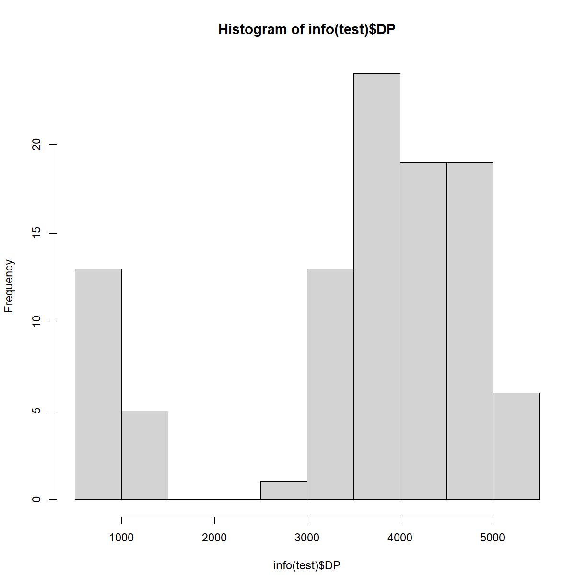
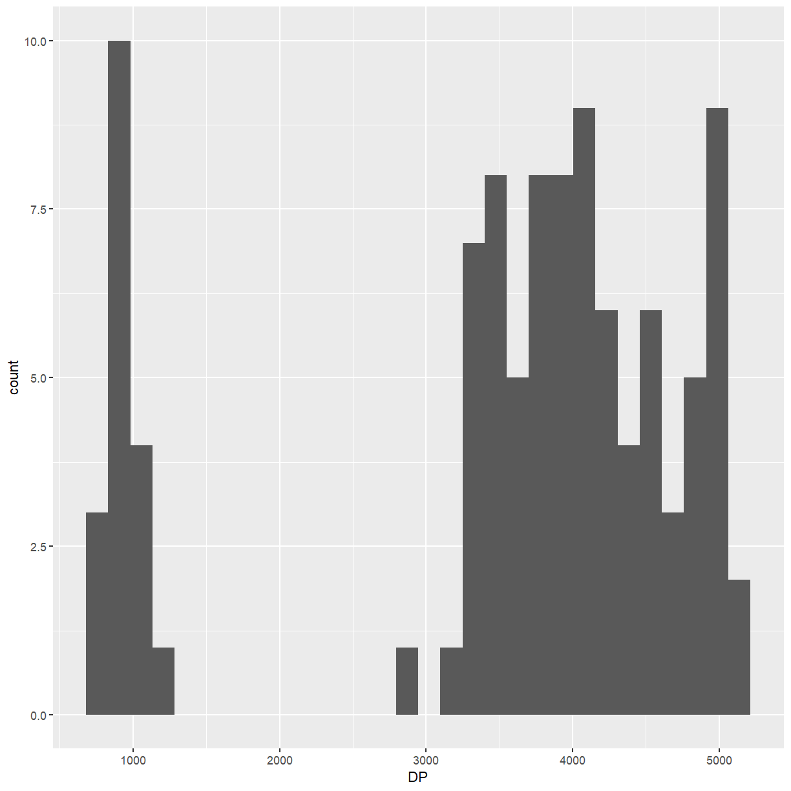

---
# Please do not edit this file directly; it is auto generated.
# Instead, please edit 03-vcf-import.md in _episodes_rmd/
source: Rmd
title: "Importing a VCF into Bioconductor"
teaching: 45
exercises: 15
questions:
- "How can I import and filter a VCF with Bioconductor?"
objectives:
- "Read genotypes and SNP metadata from a VCF into R."
- "Compress and index a VCF for quick access."
- "Use custom parameters to filter variants into a smaller file."
- "Choose which fields, samples, and genomic ranges to import into R."
keypoints:
- "Index the VCF file with indexTabix if you plan to only import certain ranges."
- "Use filterVcf to filter variants to a new file without importing data into R."
- "Use ScanVcfParam to specify which fields, samples, and genomic ranges you want to import."
---

~~~
library(GenomicRanges)
library(Rsamtools)
library(VariantAnnotation)
library(magrittr)
~~~
{: .language-r}

## Making the VCF file easy to access

We have a small VCF for this workshop, but they can be many gigabytes in size.
So, instead of reading straight from a plain text file, we will compress and
index the file.  This only needs to be done to the file once, even if you will
read data from the file many times in later R sessions.

To save time, the file you downloaded was zipped already.  If it wasn't, you
would zip it this way:

~~~
bg <- bgzip("data/hmp321_agpv4_chr1_subset.vcf")
~~~
{: .language-r}

> ## BGZIP format
>
> The BGZIP format is an extension of the GZIP format, so any command that
> would work on `.gz` files (like `zless`) works on `.bgz` files.  The
> BGZIP format was designed specifically for bioinformatics files to make
> them easy to index.  See http://www.htslib.org/doc/bgzip.html for more
> information.
{: .callout}

Instead we'll input the zipped file name directly.

~~~
bg <- "data/hmp321_agpv4_chr1_subset.vcf.bgz"
~~~
{: .language-r}

Now we'll build an index that will make it easy for R to read just particular
regions of the genome.

~~~
indexTabix(bg, format = "vcf")
~~~
{: .language-r}

~~~
[1] "data/hmp321_agpv4_chr1_subset.vcf.bgz.tbi"
~~~
{: .output}

Now we can make an object that points to the file for quick access, kind of like
the `FaFile` object we made in Episode 2.

~~~
myvcf <- VcfFile(bg)
~~~
{: .language-r}

## Scanning the header

Even a VCF that is small when compressed can take up a lot of memory when
imported into R.  So, we'll want to think carefully about how we import it.
One helpful thing you can do is just read the header, to learn more about
what data the VCF contains.

~~~
hdr <- scanVcfHeader(myvcf)
hdr
~~~
{: .language-r}

~~~
class: VCFHeader 
samples(200): 2005-4 207 ... german_F03802 german_EZ5
meta(4): HapMapVersion fileDate fileformat contig
fixed(2): FILTER ALT
info(18): DP NZ ... ImpMinorAccuracy DUP
geno(3): GT AD GL
~~~
{: .output}

Let's go through the different components that were listed.

With `samples`, we can get a character vector of all sample names in the file.
This allows us to confirm that the file contains the samples that we expect it
to.  Later we can also decide to only import genotypes from certain samples.

~~~
all_sam <- samples(hdr)
all_sam
~~~
{: .language-r}

~~~
  [1] "2005-4"              "207"                 "32"                 
  [4] "5023"                "680"                 "68139"              
  [7] "697"                 "75-14gao"            "764"                
 [10] "78004"               "78551S"              "792"                
 [13] "83IBI3"              "8982"                "9058"               
 [16] "98F1"                "B4"                  "B7"                 
 [19] "B73"                 "B76"                 "B8"                 
 [22] "B97"                 "BKN009"              "BKN011"             
 [25] "BKN017"              "BKN018"              "BKN027"             
 [28] "BKN029"              "C521"                "CAUMo17"            
 [31] "chang69"             "chang7daxian1"       "CML103"             
 [34] "CML103-run248"       "CML411"              "CN104"              
 [37] "Co109"               "CT109"               "D1139"              
 [40] "D20"                 "D23"                 "D801"               
 [43] "D857"                "D892"                "dai6"               
 [46] "DM07"                "dupl-478"            "E588"               
 [49] "E601"                "F7584"               "F939"               
 [52] "FR14"                "fu8538"              "H114"               
 [55] "H84"                 "HD568"               "hua160"             
 [58] "huangchanga"         "huotanghuang17"      "Il14H"              
 [61] "ji63"                "K22"                 "Ki11"               
 [64] "Ky21"                "LD61"                "LH1"                
 [67] "LH128"               "LH190"               "LH202"              
 [70] "LH51"                "LH60"                "lian87"             
 [73] "liao2204"            "LP1"                 "luyuan133"          
 [76] "Lx9801"              "M3736"               "MBUB"               
 [79] "Ms71"                "mu6"                 "N138"               
 [82] "N192"                "N42"                 "NC268"              
 [85] "NC358"               "ning24"              "ning45"             
 [88] "NS501"               "Oh40B"               "Pa91"               
 [91] "PHG50"               "PHG83"               "PHJ31"              
 [94] "PHJ75"               "PHK05"               "PHM10"              
 [97] "PHN11"               "PHNV9"               "PHP02"              
[100] "PHR58"               "PHT77"               "PHW17"              
[103] "PHW52"               "PHWG5"               "qiong51"            
[106] "R1656"               "RS710"               "SC24-1"             
[109] "SG17"                "shangyin110-1"       "shen142"            
[112] "SS99"                "SZ3"                 "tai184"             
[115] "TIL01-JD"            "TIL03"               "TIL09"              
[118] "Timpunia-1"          "VL056883"            "VL062784"           
[121] "W117"                "W238"                "W344"               
[124] "W499"                "W668"                "W968"               
[127] "W9706"               "wenhuang31413"       "WIL900"             
[130] "wu312"               "XF117"               "y9961"              
[133] "yan38"               "Yd6"                 "ye107"              
[136] "ye8112"              "yue39-4"             "yue89A12-1"         
[139] "zhangjin6"           "MAIdgiRAPDIAAPEI-12" "MAIdgiRAVDIAAPEI-4" 
[142] "MAIdgiRCKDIAAPEI-9"  "ZEAhwcRAXDIAAPE"     "ZEAxppRALDIAAPEI-9" 
[145] "ZEAxppRAUDIAAPEI-1"  "ZEAxppRBFDIAAPEI-3"  "ZEAxppRBMDIAAPEI-6" 
[148] "ZEAxppRCODIAAPEI-9"  "ZEAxppRDLDIAAPEI-2"  "ZEAxujRBADIAAPE"    
[151] "282set_A556"         "282set_A619"         "282set_A634"        
[154] "282set_A654"         "282set_A659"         "282set_A661"        
[157] "282set_A679"         "282set_B103"         "282set_CH701-30"    
[160] "282set_CI187-2"      "282set_CI31A"        "282set_CI64"        
[163] "282set_CM7"          "282set_CML14"        "282set_CML154Q"     
[166] "282set_CML254"       "282set_CML287"       "282set_GT112"       
[169] "282set_H99"          "282set_I29"          "282set_IDS28"       
[172] "282set_Ki21"         "282set_KY228"        "282set_MS153"       
[175] "282set_Mt42"         "282set_NC222"        "282set_NC264"       
[178] "282set_NC338"        "282set_NC346"        "282set_NC360"       
[181] "282set_NC366"        "282set_OH7B"         "282set_Os420"       
[184] "282set_Pa875"        "282set_Sg1533"       "282set_T232"        
[187] "282set_T234"         "282set_Tx601"        "282set_Tzi25"       
[190] "282set_Tzi8"         "282set_VA102"        "282set_Va14"        
[193] "282set_Va26"         "282set_W117Ht"       "282set_Wf9"         
[196] "german_Mo17"         "german_Lo11"         "german_FF0721H-7"   
[199] "german_F03802"       "german_EZ5"         
~~~
{: .output}

We can see the file date and other general information from the top of the file.

~~~
meta(hdr)
~~~
{: .language-r}

~~~
DataFrameList of length 4
names(4): HapMapVersion fileDate fileformat contig
~~~
{: .output}

~~~
for(i in names(meta(hdr))){
  meta(hdr)[[i]] %>% show()
}
~~~
{: .language-r}

~~~
DataFrame with 1 row and 1 column
                    Value
              <character>
HapMapVersion     "3.2.1"
DataFrame with 1 row and 1 column
               Value
         <character>
fileDate    20201110
DataFrame with 1 row and 1 column
                 Value
           <character>
fileformat     VCFv4.1
DataFrame with 1 row and 1 column
     assembly
  <character>
1         "1"
~~~
{: .output}

For `contig` we only see `"1"` because this file only contains variants on
chromosome 1.

We can print out descriptions of all the `INFO` fields.

~~~
info(hdr)
~~~
{: .language-r}

~~~
DataFrame with 18 rows and 3 columns
                      Number        Type            Description
                 <character> <character>            <character>
DP                         1     Integer            Total Depth
NZ                         1     Integer Number of taxa with ..
AD                         .     Integer Total allelelic dept..
AC                         .     Integer Numbers of ALT allel..
AQ                         .     Integer Average phred base q..
...                      ...         ...                    ...
NI5                        0        Flag Site with 5bp of a p..
INHMP311                   0        Flag Site peresent in Hap..
ImpHomoAccuracy            1       Float Fraction of homozygo..
ImpMinorAccuracy           1       Float Fraction of minor al..
DUP                        0        Flag Site with heterozygo..
~~~
{: .output}

~~~
info_desc <- info(hdr)$Description
names(info_desc) <- rownames(info(hdr))
info_desc
~~~
{: .language-r}

~~~
                                                                                                                                             DP 
                                                                                                                                  "Total Depth" 
                                                                                                                                             NZ 
                                                                                                         "Number of taxa with called genotypes" 
                                                                                                                                             AD 
                                                                                     "Total allelelic depths in order listed starting with REF" 
                                                                                                                                             AC 
                                                                                                       "Numbers of ALT alleles in order listed" 
                                                                                                                                             AQ 
                                                                     "Average phred base quality for alleles in order listed starting with REF" 
                                                                                                                                             GN 
                                                                 "Number of taxa with genotypes AA,AB,BB or AA,AB,AC,BB,BC,CC if 2 alt alleles" 
                                                                                                                                             HT 
                                                                                                                      "Number of heterozygotes" 
                                                                                                                                             EF 
"EF=het_frequency/(presence_frequency * minor_allele_frequency), if 2 alt alleles,EF for AB,AC,BC pairsis given; from 916 taxa of HapMap 3.1.1" 
                                                                                                                                             PV 
                                       "p-value from segregation test between AB or AB, AC, BC if 2 alt alleles, from 916 taxa of HapMap 3.1.1" 
                                                                                                                                            MAF 
                                                                                                                       "Minor allele frequency" 
                                                                                                                                           MAF0 
                                                                              "Minor allele frequency from unimputed HapMap 3.2.1 on 1210 taxa" 
                                                                                                                                           IBD1 
                                                                   "only one allele present in IBD contrasts; based on 916 taxa of HapMap3.1.1" 
                                                                                                                                            LLD 
                                                                                "Site in local LD with GBS map (from 916 taxa of HapMap 3.1.1)" 
                                                                                                                                            NI5 
                                                                              "Site with 5bp of a putative indel from 916 taxa of HapMap 3.1.1" 
                                                                                                                                       INHMP311 
                                                                                                                 "Site peresent in HapMap3.1.1" 
                                                                                                                                ImpHomoAccuracy 
                                                                                        "Fraction of homozygotes imputed back into homozygotes" 
                                                                                                                               ImpMinorAccuracy 
                                                             "Fraction of minor allele homozygotes imputed back into minor allelel homozygotes" 
                                                                                                                                            DUP 
                                                                                                       "Site with heterozygotes frequency > 3%" 
~~~
{: .output}

> ## Descriptions of the FORMAT fields
>
> Print out descriptions of the `FORMAT` fields.  Look at `hdr` again to find
> a function to do this.  You might also look back at Episode 1 to remind
> yourself of what the `FORMAT` fields represent.
>
> > ## Solution
> > 
> > ~~~
> > geno(hdr)
> > ~~~
> > {: .language-r}
> > 
> > 
> > 
> > ~~~
> > DataFrame with 3 rows and 3 columns
> >         Number        Type            Description
> >    <character> <character>            <character>
> > GT           1      String               Genotype
> > AD           .     Integer Allelic depths for t..
> > GL           .     Integer Genotype likelihoods..
> > ~~~
> > {: .output}
> > 
> > 
> > 
> > ~~~
> > geno(hdr)$Description
> > ~~~
> > {: .language-r}
> > 
> > 
> > 
> > ~~~
> > [1] "Genotype"                                                                                 
> > [2] "Allelic depths for the reference and alternate alleles in the order listed"               
> > [3] "Genotype likelihoods for 0/0, 0/1, 1/1, or  0/0, 0/1, 0/2, 1/1, 1/2, 2/2 if 2 alt alleles"
> > ~~~
> > {: .output}
> {: .solution}
{: .challenge}

## Importing the first chunk of the file

How are the actual data formatted?  We don't want to read the whole file,
but here is how we can read just the first 100 entries.

~~~
myvcf2 <- VcfFile(bg, yieldSize = 100)

test <- readVcf(myvcf2)

test
~~~
{: .language-r}

~~~
class: CollapsedVCF 
dim: 100 200 
rowRanges(vcf):
  GRanges with 5 metadata columns: paramRangeID, REF, ALT, QUAL, FILTER
info(vcf):
  DataFrame with 18 columns: DP, NZ, AD, AC, AQ, GN, HT, EF, PV, MAF, MAF0, ...
info(header(vcf)):
                    Number Type    Description                                 
   DP               1      Integer Total Depth                                 
   NZ               1      Integer Number of taxa with called genotypes        
   AD               .      Integer Total allelelic depths in order listed st...
   AC               .      Integer Numbers of ALT alleles in order listed      
   AQ               .      Integer Average phred base quality for alleles in...
   GN               .      Integer Number of taxa with genotypes AA,AB,BB or...
   HT               1      Integer Number of heterozygotes                     
   EF               .      Float   EF=het_frequency/(presence_frequency * mi...
   PV               .      Float   p-value from segregation test between AB ...
   MAF              1      Float   Minor allele frequency                      
   MAF0             1      Float   Minor allele frequency from unimputed Hap...
   IBD1             0      Flag    only one allele present in IBD contrasts;...
   LLD              0      Flag    Site in local LD with GBS map (from 916 t...
   NI5              0      Flag    Site with 5bp of a putative indel from 91...
   INHMP311         0      Flag    Site peresent in HapMap3.1.1                
   ImpHomoAccuracy  1      Float   Fraction of homozygotes imputed back into...
   ImpMinorAccuracy 1      Float   Fraction of minor allele homozygotes impu...
   DUP              0      Flag    Site with heterozygotes frequency > 3%      
geno(vcf):
  List of length 3: GT, AD, GL
geno(header(vcf)):
      Number Type    Description                                               
   GT 1      String  Genotype                                                  
   AD .      Integer Allelic depths for the reference and alternate alleles ...
   GL .      Integer Genotype likelihoods for 0/0, 0/1, 1/1, or  0/0, 0/1, 0...
~~~
{: .output}

We could get the same header from above using the `header` function.
We can also now get information about the first 100 variants.  The `rowRanges`
function gets us a `GRanges` object indicating the name and position of each
SNP, along with the reference and alternative allele.

~~~
rowRanges(test)
~~~
{: .language-r}

~~~
GRanges object with 100 ranges and 5 metadata columns:
             seqnames    ranges strand | paramRangeID            REF
                <Rle> <IRanges>  <Rle> |     <factor> <DNAStringSet>
  1-20689192        1  21000162      * |           NA              G
  1-20689220        1  21000190      * |           NA              G
  1-20689236        1  21000206      * |           NA              C
  1-20689304        1  21000274      * |           NA              C
  1-20689307        1  21000277      * |           NA              A
         ...      ...       ...    ... .          ...            ...
  1-20690571        1  21001541      * |           NA              C
  1-20690577        1  21001547      * |           NA              C
  1-20690617        1  21001587      * |           NA              C
  1-20690618        1  21001588      * |           NA              G
  1-20690639        1  21001609      * |           NA              A
                         ALT      QUAL      FILTER
             <CharacterList> <numeric> <character>
  1-20689192               T        NA        PASS
  1-20689220               A        NA        PASS
  1-20689236               A        NA        PASS
  1-20689304               A        NA        PASS
  1-20689307               G        NA        PASS
         ...             ...       ...         ...
  1-20690571               T        NA        PASS
  1-20690577               A        NA        PASS
  1-20690617               T        NA        PASS
  1-20690618               A        NA        PASS
  1-20690639               T        NA        PASS
  -------
  seqinfo: 1 sequence from "1" genome; no seqlengths
~~~
{: .output}

The `info` function gets us a data frame with all of the `INFO` variables.

~~~
info(test)
~~~
{: .language-r}

~~~
DataFrame with 100 rows and 18 columns
                  DP        NZ            AD            AC            AQ
           <integer> <integer> <IntegerList> <IntegerList> <IntegerList>
1-20689192       853      1203         844,9            14         34,34
1-20689220       857      1203        847,10            15         33,32
1-20689236       866      1190       674,192           193         33,30
1-20689304       961      1181        878,83           153         35,32
1-20689307       961      1210         957,4             4         33,30
...              ...       ...           ...           ...           ...
1-20690571      3314      1210       3281,33             6         34,35
1-20690577      3199      1182      599,2600          1829         34,33
1-20690617      3289      1210       3277,12             4         35,37
1-20690618      3271      1210       3251,20            10         35,35
1-20690639      3256      1210        3252,4             2         34,32
                      GN        HT            EF            PV       MAF
           <IntegerList> <integer> <NumericList> <NumericList> <numeric>
1-20689192      1195,2,6         2             1         0.001     0.006
1-20689220      1194,3,6         3          1.23         0.002     0.006
1-20689236    1085,17,88        17          0.71             0     0.081
1-20689304    1098,13,70        13          1.59             0     0.065
1-20689307      1207,2,1         2          2.24         0.004     0.002
...                  ...       ...           ...           ...       ...
1-20690571      1206,2,2         2          1.45             0     0.002
1-20690577     266,3,913         3          0.06             0     0.226
1-20690617      1208,0,2         0             0             0     0.002
1-20690618      1204,2,4         2          0.82             0     0.004
1-20690639      1209,0,1         0             0         0.008     0.001
                MAF0      IBD1       LLD       NI5  INHMP311 ImpHomoAccuracy
           <numeric> <logical> <logical> <logical> <logical>       <numeric>
1-20689192     0.020      TRUE     FALSE     FALSE     FALSE        0.983942
1-20689220     0.019     FALSE     FALSE     FALSE     FALSE        0.988387
1-20689236     0.167     FALSE      TRUE     FALSE      TRUE        0.970551
1-20689304     0.068     FALSE      TRUE     FALSE      TRUE        0.981187
1-20689307     0.004      TRUE     FALSE     FALSE     FALSE        0.995828
...              ...       ...       ...       ...       ...             ...
1-20690571     0.005      TRUE     FALSE     FALSE     FALSE        0.999100
1-20690577     0.205     FALSE      TRUE     FALSE      TRUE        0.995400
1-20690617     0.003      TRUE     FALSE     FALSE     FALSE        0.995816
1-20690618     0.008     FALSE     FALSE     FALSE     FALSE        0.995766
1-20690639     0.002      TRUE     FALSE     FALSE      TRUE        0.997494
           ImpMinorAccuracy       DUP
                  <numeric> <logical>
1-20689192         0.000000     FALSE
1-20689220         0.307692     FALSE
1-20689236         0.859813      TRUE
1-20689304         0.962963      TRUE
1-20689307         0.000000     FALSE
...                     ...       ...
1-20690571         0.800000     FALSE
1-20690577         0.977578     FALSE
1-20690617         0.000000     FALSE
1-20690618         0.444444     FALSE
1-20690639         0.000000     FALSE
~~~
{: .output}

The `geno` function gets us data associated with each genotype.  We use the `$`
accessor to get each field.

~~~
geno(test)$GT[1:10,1:5]
~~~
{: .language-r}

~~~
           2005-4 207   32    5023  680  
1-20689192 "0/0"  "0/0" "0/0" "0/0" "0/0"
1-20689220 "0/0"  "0/0" "0/0" "0/0" "0/0"
1-20689236 "0/0"  "0/0" "0/0" "0/0" "0/0"
1-20689304 "0/0"  "0/0" "0/0" "0/0" "0/0"
1-20689307 "0/0"  "0/0" "0/0" "0/0" "0/0"
1-20689321 "0/0"  "0/0" "0/0" "0/0" "0/0"
1-20689326 "0/0"  "0/0" "0/0" "1/1" "./."
1-20689334 "0/0"  "0/0" "0/0" "0/0" "0/0"
1-20689549 "0/0"  "0/0" "0/0" "0/0" "0/0"
1-20689561 "1/1"  "1/1" "./." "0/0" "1/1"
~~~
{: .output}

> ## Reading the file in chunks
>
> With the `yieldSize` argument, we could actually call `readVcf` repeatedly
> to go through the whole file one chunk at a time.  In that case we would
> call `open(myvcf2)` before calling `readVcf`, then call `close(myvcf2)`
> once we were done reading the file.
{: .callout}

## Filtering the file

Before we import, we can filter the file to eliminate variants that we know we
aren't interested in.  This is optional of course, but will save us some memory
and computational time when we import the data later.  It will also give us a
VCF that we could import into other software.

Let's filter on a few of the INFO fields.  According to
[documentation of this dataset](https://www.panzea.org/genotypes), the `LLD`
flag indicates good quality markers.  The `DUP` flag indicates a high proportion
of heterozygotes (for an inbred crop like maize) and so we should probably throw
away markers with that flag.  Finally, let's set a minimum minor allele frequency
(`MAF`) at 0.01.  We'll look at the formatting of these fields.

~~~
info(hdr)[c("LLD", "DUP", "MAF"),]
~~~
{: .language-r}

~~~
DataFrame with 3 rows and 3 columns
         Number        Type            Description
    <character> <character>            <character>
LLD           0        Flag Site in local LD wit..
DUP           0        Flag Site with heterozygo..
MAF           1       Float Minor allele frequency
~~~
{: .output}

`LLD` and `DUP` are "flags", which means that the abbreviation will either be
present or absent in the `INFO` column.  `MAF` is a "float" (which just means
a number that is not necessarily an integer) with one value per marker.

For each rule, we need to create a function that will return `TRUE` if we want
to keep the variant and `FALSE` if we want to discard it.  For our `MAF` filter,
we'll make a function that can work on an imported VCF.

> ## Creating functions
>
> See the [software carpentry tutorial](http://swcarpentry.github.io/r-novice-gapminder/10-functions/index.html)
> on how to create functions in R.
{: .callout}

~~~
maf01 <- function(vcf){
  info(vcf)$MAF >= 0.01
}
~~~
{: .language-r}

We can test it out on the chunk of the VCF we imported above.

~~~
maf01(test) %>% head()
~~~
{: .language-r}

~~~
[1] FALSE FALSE  TRUE  TRUE FALSE  TRUE
~~~
{: .output}

When we can, it's more efficient for filtering to test the plain text of the
file than to import it into R.  Because `LLD` and `DUP` are "flags", those
abbreviations will either be in the `INFO` field or not, which translates
to `TRUE` and `FALSE` in our `info(test)` data frame.  We can use the `grepl`
function to search for those strings in the unprocessed file.  Let's use
`readLines` to import some of the file for testing.

~~~
testlines <- readLines(bg, n = 150)
testlines <- testlines[!startsWith(testlines, "#")] # eliminate headers
~~~
{: .language-r}

Now we'll test using `grepl`.  For space I am just looking at two lines, but
in real life I would probably look at more.

~~~
testLLD <- grepl("LLD", testlines)
head(testlines[testLLD], n = 2)  # lines that should have LLD
~~~
{: .language-r}

~~~
[1] "1\t21000206\t1-20689236\tC\tA\t.\tPASS\tDP=866;NZ=1190;AD=674,192;AC=193;AQ=33,30;GN=1085,17,88;HT=17;EF=0.71;PV=0;MAF=0.081;MAF0=0.167;LLD;INHMP311;ImpHomoAccuracy=0.970550576184379;ImpMinorAccuracy=0.85981308411215;DUP\tGT:AD:GL\t0/0::\t0/0::\t0/0:2,0:0,6,55\t0/0:2,0:0,6,55\t0/0::\t0/0::\t1/1::\t0/0::\t0/0:1,0:0,3,28\t0/0::\t0/1:1,3:71,0,16\t0/0::\t0/0::\t0/0::\t0/1:1,1:22,0,22\t0/0:3,0:0,9,83\t0/0::\t0/0::\t0/0:2,0:0,6,55\t0/0::\t0/0::\t0/0:1,0:0,3,28\t0/0::\t0/0::\t0/0::\t0/0::\t0/0:1,0:0,3,28\t0/0::\t0/0:1,0:0,3,28\t0/0::\t0/0:2,0:0,6,55\t0/0::\t0/1:1,6:145,0,7\t1/1:0,20:555,60,0\t0/0:1,0:0,3,28\t0/0::\t0/0::\t0/0::\t0/0:7,0:0,21,194\t0/0::\t1/1:0,1:28,3,0\t0/0::\t0/0:3,0:0,9,83\t0/0::\t1/1:0,1:28,3,0\t0/0::\t0/0::\t0/0::\t1/1:0,1:28,3,0\t0/0::\t0/0::\t0/0::\t0/0:3,0:0,9,83\t0/0::\t0/0::\t0/0::\t0/0::\t0/0::\t0/0::\t0/0::\t0/0:2,0:0,6,55\t0/0:2,0:0,6,55\t0/0::\t0/0::\t0/0::\t0/0::\t0/0:2,0:0,6,55\t0/0:1,0:0,3,28\t0/0:2,0:0,6,55\t0/0::\t0/0:3,0:0,9,83\t0/0::\t0/0::\t0/0::\t0/0::\t0/0:1,0:0,3,28\t0/0::\t./.::\t0/0::\t./.::\t0/0::\t0/0::\t0/0::\t0/0:2,0:0,6,55\t0/0:8,0:0,24,222\t0/1:1,3:71,0,16\t0/0:1,0:0,3,28\t0/0::\t0/1:1,4:96,0,13\t0/0::\t0/0::\t0/0::\t0/0::\t0/0::\t0/0::\t0/0::\t0/0::\t0/0::\t0/0::\t0/0::\t0/0::\t0/0::\t0/0::\t0/0::\t0/0::\t0/0::\t0/0::\t1/1::\t0/0::\t0/0::\t0/0:1,0:0,3,28\t0/0::\t0/0:2,0:0,6,55\t0/0:2,0:0,6,55\t0/0::\t0/0:2,0:0,6,55\t0/0:5,0:0,15,139\t0/0:1,0:0,3,28\t0/0:3,0:0,9,83\t0/0:1,0:0,3,28\t0/0:4,0:0,12,111\t0/0::\t0/0::\t0/0::\t1/1:0,1:28,3,0\t1/1::\t1/1:0,2:55,6,0\t0/0:1,0:0,3,28\t0/0:2,0:0,6,55\t0/0:1,0:0,3,28\t0/0::\t0/0::\t./.::\t0/0::\t0/0:1,0:0,3,28\t0/0:1,0:0,3,28\t0/0:2,0:0,6,55\t0/0:1,0:0,3,28\t0/0::\t0/0:8,0:0,24,222\t0/0:2,0:0,6,55\t0/0:2,0:0,6,55\t0/0::\t0/0::\t0/0::\t0/0:6,0:0,18,166\t0/0::\t0/0:1,0:0,3,28\t0/0:3,0:0,9,83\t1/1:0,7:194,21,0\t0/0:1,0:0,3,28\t1/1:0,1:28,3,0\t0/0::\t0/0:1,0:0,3,28\t0/0::\t0/0::\t0/0::\t0/0:1,0:0,3,28\t0/0::\t0/0::\t0/0::\t0/0::\t0/0:1,0:0,3,28\t0/0:2,0:0,6,55\t0/0::\t0/0:1,0:0,3,28\t0/0::\t0/0::\t1/1:0,2:55,6,0\t0/0::\t0/0::\t0/0::\t0/0:1,0:0,3,28\t1/1::\t0/0:1,0:0,3,28\t0/0::\t0/1:1,2:46,0,19\t0/0:1,0:0,3,28\t0/0:1,0:0,3,28\t0/0:1,0:0,3,28\t1/1:0,2:55,6,0\t0/0:1,0:0,3,28\t0/0::\t0/0:1,0:0,3,28\t0/0::\t0/0:1,0:0,3,28\t0/0::\t1/1:0,1:28,3,0\t0/0:2,0:0,6,55\t0/0::\t0/0:1,0:0,3,28\t0/0::\t1/1:0,3:83,9,0\t0/0::\t0/0:3,0:0,9,83\t0/0::\t0/0:3,0:0,9,83\t0/0:1,0:0,3,28\t0/0:1,0:0,3,28\t0/0::"
[2] "1\t21000274\t1-20689304\tC\tA\t.\tPASS\tDP=961;NZ=1181;AD=878,83;AC=153;AQ=35,32;GN=1098,13,70;HT=13;EF=1.59;PV=0;MAF=0.065;MAF0=0.068;LLD;INHMP311;ImpHomoAccuracy=0.981186685962373;ImpMinorAccuracy=0.962962962962963;DUP\tGT:AD:GL\t0/0::\t0/0::\t0/0::\t0/0::\t0/0::\t0/0::\t1/1::\t0/0::\t0/0:2,0:0,6,55\t0/0::\t1/1::\t0/0::\t0/0::\t0/0::\t0/0::\t0/0:2,0:0,6,55\t0/0::\t0/0::\t0/0:1,0:0,3,28\t0/0::\t0/0::\t0/0:1,0:0,3,28\t0/0:1,0:0,3,28\t0/0::\t0/0::\t0/0::\t0/0:1,0:0,3,28\t0/0::\t0/0::\t0/0::\t0/0::\t0/0::\t0/1:6,3:56,0,139\t1/1:0,13:361,39,0\t0/0::\t0/0:1,0:0,3,28\t0/0::\t0/0::\t0/0:2,0:0,6,55\t0/0::\t1/1:0,1:28,3,0\t0/0::\t0/0:3,0:0,9,83\t0/0::\t./.::\t0/0::\t0/0:1,0:0,3,28\t0/0::\t1/1::\t0/0::\t0/0:1,0:0,3,28\t0/0::\t0/0:2,0:0,6,55\t0/0::\t0/0::\t0/0::\t0/0::\t0/0::\t0/0::\t0/0:1,0:0,3,28\t0/0::\t0/0:1,0:0,3,28\t0/0:2,0:0,6,55\t0/0:1,0:0,3,28\t0/0::\t0/0::\t0/0:3,0:0,9,83\t0/0::\t0/0::\t0/0::\t0/0:2,0:0,6,55\t0/0::\t0/0::\t0/0::\t0/0::\t0/0:1,0:0,3,28\t0/0::\t./.::\t0/0:2,0:0,6,55\t0/0::\t0/0::\t0/0::\t0/0::\t0/0:3,0:0,9,83\t0/0:15,0:0,45,416\t1/1:0,1:28,3,0\t0/0:1,0:0,3,28\t0/0::\t0/1:12,8:162,0,273\t0/0::\t0/0::\t0/0::\t0/0::\t0/0::\t0/0::\t0/0:1,0:0,3,28\t0/0::\t0/0::\t0/0::\t0/0::\t0/0::\t0/0::\t0/0::\t0/0::\t0/0::\t0/0::\t0/0::\t1/1::\t0/0:1,0:0,3,28\t0/0::\t0/0::\t0/0::\t0/0:1,0:0,3,28\t0/0::\t0/0:1,0:0,3,28\t0/0:2,0:0,6,55\t0/0:4,0:0,12,111\t0/0:1,0:0,3,28\t0/0::\t0/0::\t0/0:2,0:0,6,55\t0/0::\t0/0::\t0/0::\t1/1:0,1:28,3,0\t1/1::\t1/1::\t0/0::\t0/0:1,0:0,3,28\t0/0::\t0/0::\t0/0::\t./.::\t0/0::\t0/0::\t0/0:1,0:0,3,28\t0/0::\t0/0:2,0:0,6,55\t0/0::\t0/0:4,0:0,12,111\t0/0::\t0/0::\t0/0::\t0/0::\t0/0::\t0/0:15,0:0,45,416\t0/0::\t0/0::\t0/0:3,0:0,9,83\t1/1:0,5:139,15,0\t0/0:3,0:0,9,83\t1/1::\t0/0:2,0:0,6,55\t0/0:1,0:0,3,28\t0/0::\t0/0:1,0:0,3,28\t0/0::\t0/0:1,0:0,3,28\t0/0::\t0/0:4,0:0,12,111\t0/0::\t0/0::\t0/0:1,0:0,3,28\t0/0:3,0:0,9,83\t0/0:3,0:0,9,83\t0/0:2,0:0,6,55\t0/0:2,0:0,6,55\t0/0::\t0/1:1,2:46,0,19\t0/0:3,0:0,9,83\t0/0::\t0/0:2,0:0,6,55\t0/0:2,0:0,6,55\t0/0:1,0:0,3,28\t0/0:1,0:0,3,28\t0/0:1,0:0,3,28\t0/1:1,1:22,0,22\t0/0:2,0:0,6,55\t0/0:2,0:0,6,55\t./.::\t1/1:0,1:28,3,0\t0/0:1,0:0,3,28\t0/0::\t0/0:1,0:0,3,28\t0/0::\t0/0:1,0:0,3,28\t0/0::\t1/1:0,2:55,6,0\t0/0:2,0:0,6,55\t0/0:2,0:0,6,55\t0/0:3,0:0,9,83\t0/0::\t0/1:1,3:71,0,16\t0/0:1,0:0,3,28\t0/0:5,0:0,15,139\t0/0::\t0/0::\t0/0::\t0/0:1,0:0,3,28\t0/0::"                                                 
~~~
{: .output}

~~~
head(testlines[!testLLD], n = 2) # lines that should not have LLD
~~~
{: .language-r}

~~~
[1] "1\t21000162\t1-20689192\tG\tT\t.\tPASS\tDP=853;NZ=1203;AD=844,9;AC=14;AQ=34,34;GN=1195,2,6;HT=2;EF=1;PV=0.001;MAF=0.006;MAF0=0.02;IBD1;ImpHomoAccuracy=0.983941605839416;ImpMinorAccuracy=0\tGT:AD:GL\t0/0::\t0/0::\t0/0:1,0:0,3,28\t0/0:2,0:0,6,55\t0/0::\t0/0::\t0/0::\t0/0:1,0:0,3,28\t0/0::\t0/0::\t0/0:6,0:0,18,166\t0/0::\t0/0::\t0/0::\t0/0:1,0:0,3,28\t0/0:3,0:0,9,83\t0/0::\t0/0::\t0/0:1,0:0,3,28\t0/0::\t0/0::\t0/0::\t0/0::\t0/0:2,0:0,6,55\t0/0::\t0/0::\t0/0::\t0/0::\t0/0:1,0:0,3,28\t0/0::\t0/0:1,0:0,3,28\t0/0::\t0/0:5,0:0,15,139\t0/0:21,0:0,63,583\t0/0:1,0:0,3,28\t0/0::\t0/0::\t0/0::\t0/0:5,0:0,15,139\t0/0::\t0/0:2,0:0,6,55\t0/0::\t0/0::\t0/0::\t0/0:3,0:0,9,83\t0/0::\t0/0:1,0:0,3,28\t0/0::\t0/0::\t0/0::\t0/0:1,0:0,3,28\t0/0::\t0/0:1,0:0,3,28\t0/0::\t0/0::\t0/0::\t0/0::\t./.::\t0/0:1,0:0,3,28\t0/0::\t0/0:4,0:0,12,111\t0/0::\t0/0::\t0/0::\t0/0::\t0/0::\t0/0::\t0/0:5,0:0,15,139\t0/0:4,0:0,12,111\t0/0::\t0/0:1,0:0,3,28\t0/0::\t0/0::\t0/0::\t0/0::\t0/0:1,0:0,3,28\t0/0::\t0/0::\t0/0::\t0/0::\t0/0::\t0/0::\t0/0::\t0/0:6,0:0,18,166\t0/0:2,0:0,6,55\t0/0:2,0:0,6,55\t0/0::\t0/0::\t0/0:3,0:0,9,83\t0/0::\t0/0::\t0/0::\t0/0::\t0/0::\t0/0::\t0/0:1,0:0,3,28\t0/0::\t0/0::\t0/0::\t0/0:1,0:0,3,28\t0/0::\t0/0::\t0/0::\t0/0:1,0:0,3,28\t0/0::\t0/0::\t0/0::\t0/0:2,0:0,6,55\t0/0::\t0/0::\t0/0::\t0/0::\t0/0:1,0:0,3,28\t0/0::\t0/0:2,0:0,6,55\t0/0::\t0/0:1,0:0,3,28\t0/0:1,0:0,3,28\t0/0:1,0:0,3,28\t0/0::\t0/0:3,0:0,9,83\t0/0::\t0/0::\t0/0::\t0/0:4,0:0,12,111\t0/0:1,0:0,3,28\t0/0:2,0:0,6,55\t0/0:1,0:0,3,28\t0/0:1,0:0,3,28\t0/0:1,0:0,3,28\t0/0::\t0/0:1,0:0,3,28\t0/0::\t0/0::\t0/0::\t0/0:4,0:0,12,111\t0/0:2,0:0,6,55\t0/0:2,0:0,6,55\t0/0::\t0/0:9,0:0,27,250\t0/0::\t0/0:1,0:0,3,28\t0/0::\t0/0::\t0/0::\t0/0:6,0:0,18,166\t0/0::\t0/0::\t0/0:1,0:0,3,28\t0/0:5,0:0,15,139\t0/0::\t0/0:2,0:0,6,55\t0/0::\t0/0:2,0:0,6,55\t0/0::\t0/0::\t0/0::\t0/0::\t0/0::\t0/0::\t0/0::\t0/0::\t0/0::\t0/0:1,0:0,3,28\t0/0::\t0/0::\t0/0::\t0/0::\t0/0:2,0:0,6,55\t0/0::\t0/0::\t0/0::\t0/0::\t0/0::\t0/0::\t0/0::\t0/1:2,1:19,0,46\t0/0::\t0/0::\t0/0:1,0:0,3,28\t0/0:3,0:0,9,83\t0/0::\t0/0::\t0/0:1,0:0,3,28\t0/0::\t0/0:1,0:0,3,28\t0/0::\t0/0::\t0/0:1,0:0,3,28\t0/0::\t0/0::\t0/0::\t0/0:2,0:0,6,55\t0/0::\t0/0:3,0:0,9,83\t0/0::\t0/0:2,0:0,6,55\t0/0::\t0/0::\t0/0::"                                                                                                                                          
[2] "1\t21000190\t1-20689220\tG\tA\t.\tPASS\tDP=857;NZ=1203;AD=847,10;AC=15;AQ=33,32;GN=1194,3,6;HT=3;EF=1.23;PV=0.002;MAF=0.006;MAF0=0.019;ImpHomoAccuracy=0.988387096774194;ImpMinorAccuracy=0.307692307692308\tGT:AD:GL\t0/0::\t0/0::\t0/0:2,0:0,6,55\t0/0:2,0:0,6,55\t0/0::\t0/0::\t0/0::\t0/0:1,0:0,3,28\t0/0::\t0/0::\t0/0:4,0:0,12,111\t0/0::\t0/0::\t0/0::\t0/0:2,0:0,6,55\t0/0:3,0:0,9,83\t0/0::\t0/0::\t0/0:1,0:0,3,28\t0/0::\t0/0::\t0/0::\t0/0::\t0/0::\t0/0::\t0/0::\t0/0:1,0:0,3,28\t0/0::\t0/0:1,0:0,3,28\t0/0::\t0/0:2,0:0,6,55\t0/0::\t0/0:7,0:0,21,194\t0/0:20,0:0,60,555\t0/0:1,0:0,3,28\t0/0::\t0/0::\t0/0::\t0/0:7,0:0,21,194\t0/0::\t0/0:3,0:0,9,83\t0/0::\t0/0:3,0:0,9,83\t0/0::\t0/0:2,0:0,6,55\t0/0::\t0/0::\t0/0::\t0/0:1,0:0,3,28\t0/0::\t0/0:1,0:0,3,28\t0/0::\t0/0:2,0:0,6,55\t0/0::\t0/0::\t0/0::\t0/0::\t0/0::\t0/0:1,0:0,3,28\t0/0::\t0/0:3,0:0,9,83\t0/0::\t0/0::\t0/0::\t0/0::\t0/0::\t0/0:1,0:0,3,28\t0/0:3,0:0,9,83\t0/0:4,0:0,12,111\t0/0::\t0/0:3,0:0,9,83\t0/0::\t0/0::\t0/0::\t0/0::\t0/0:1,0:0,3,28\t0/0::\t0/0::\t0/0::\t0/0::\t0/0::\t0/0::\t0/0::\t0/0:2,0:0,6,55\t0/0:5,0:0,15,139\t0/0:4,0:0,12,111\t0/0::\t0/0::\t0/0:5,0:0,15,139\t0/0::\t0/0::\t0/0::\t0/0:1,0:0,3,28\t0/0::\t0/0::\t0/0::\t0/0::\t0/0::\t0/0::\t0/0::\t0/0::\t0/0::\t0/0::\t0/0::\t0/0::\t0/0::\t0/0::\t0/0::\t0/0::\t0/0::\t0/0:1,0:0,3,28\t0/0::\t0/0:2,0:0,6,55\t0/0:2,0:0,6,55\t0/0:1,0:0,3,28\t0/1:1,2:46,0,19\t0/0:2,0:0,6,55\t0/0:1,0:0,3,28\t0/0:1,0:0,3,28\t0/0:1,0:0,3,28\t0/0:6,0:0,18,166\t0/0::\t0/0::\t0/0::\t0/0:2,0:0,6,55\t0/0::\t0/0:2,0:0,6,55\t0/0::\t0/0:2,0:0,6,55\t0/0:1,0:0,3,28\t0/0::\t0/0:1,0:0,3,28\t0/0::\t0/0::\t0/0:1,0:0,3,28\t0/0:2,0:0,6,55\t0/0:2,0:0,6,55\t0/0:1,0:0,3,28\t0/0::\t0/0:5,0:0,15,139\t0/0:2,0:0,6,55\t0/0:2,0:0,6,55\t0/0::\t0/0::\t0/0::\t0/0:7,0:0,21,194\t0/0::\t0/0:1,0:0,3,28\t0/0:1,0:0,3,28\t0/0:3,0:0,9,83\t0/0:1,0:0,3,28\t0/0:1,0:0,3,28\t0/0::\t0/0:1,0:0,3,28\t0/0::\t0/0::\t0/0::\t0/0::\t0/0::\t0/0:1,0:0,3,28\t0/0::\t0/0::\t0/0:1,0:0,3,28\t0/0:1,0:0,3,28\t0/0::\t0/0:1,0:0,3,28\t0/0::\t0/0::\t0/0:2,0:0,6,55\t0/0::\t0/0::\t0/0::\t0/0::\t0/0::\t0/0:1,0:0,3,28\t0/0::\t0/0:3,0:0,9,83\t0/0:1,0:0,3,28\t0/0::\t0/0:1,0:0,3,28\t0/0:3,0:0,9,83\t0/0:1,0:0,3,28\t0/0::\t0/0:1,0:0,3,28\t0/0::\t0/0:1,0:0,3,28\t0/0::\t0/0:1,0:0,3,28\t0/0:2,0:0,6,55\t0/0::\t0/0::\t0/0::\t0/0:2,0:0,6,55\t0/0::\t0/0:3,0:0,9,83\t0/0::\t0/0:3,0:0,9,83\t0/0:1,0:0,3,28\t0/0:1,0:0,3,28\t0/0::"
~~~
{: .output}

> ## grepl
>
> If you are confused about what `grepl` does, try:
>
> 
> ~~~
> grepl("a", c("cat", "dog", "banana", "ACGT"))
> ~~~
> {: .language-r}
{: .callout}

When the `LLD` flag is present, we see it after `MAF0`. Now let's build our
command into a function, and make a similar one for `DUP`.

~~~
LLD_yes <- function(lines){
  grepl("LLD", lines)
}

DUP_no <- function(lines){
  !grepl("DUP", lines)
}

head(LLD_yes(testlines))
~~~
{: .language-r}

~~~
[1] FALSE FALSE  TRUE  TRUE FALSE  TRUE
~~~
{: .output}

~~~
head(info(test)$LLD)
~~~
{: .language-r}

~~~
[1] FALSE FALSE  TRUE  TRUE FALSE  TRUE
~~~
{: .output}

~~~
head(DUP_no(testlines))
~~~
{: .language-r}

~~~
[1]  TRUE  TRUE FALSE FALSE  TRUE FALSE
~~~
{: .output}

~~~
head(info(test)$DUP)
~~~
{: .language-r}

~~~
[1] FALSE FALSE  TRUE  TRUE FALSE  TRUE
~~~
{: .output}

These tests on the first six variants show that the functions are behaving as
expected.

Now that we have build these three functions, we can use them for filtering the
VCF.  Functions that act on plain text go into the `prefilters` argument, and
functions that act on imported data go into the `filters` argument.  We'll set
`index` to `TRUE` so that the output will already be compressed and indexed for
our use.

~~~
filterVcf(myvcf, genome = "Zm-B73-4.0",
          destination = "data/hmp321_agpv4_chr1_subset_filtered.vcf",
          prefilters = FilterRules(list(LLD_yes, DUP_no)),
          filters = FilterRules(list(maf01)),
          index = TRUE)
~~~
{: .language-r}

~~~
starting prefilter
prefiltering 120304 records
prefiltered to C:\Users\lvclark\AppData\Local\Temp\RtmpYJMA8u\file28341ebc6331
prefilter compressing and indexing C:\Users\lvclark\AppData\Local\Temp\RtmpYJMA8u\file28341ebc6331
starting filter
filtering 41500 records
completed filtering
compressing and indexing data/hmp321_agpv4_chr1_subset_filtered.vcf
~~~
{: .output}

If you look at the `data` directory, you should see the new file and its
index now.

> ## Challenge
>
> Make a filtering function that would only retain markers where the total
> read depth was over 2000.
>
> > ## Solution
> >
> > 
> > ~~~
> > DP2000 <- function(vcf){
> >   info(vcf)$DP > 2000
> > }
> > ~~~
> > {: .language-r}
> {: .solution}
{: .challenge}

> ## Bonus challenge
>
> Use your knowledge of R to plot the distribution of total read depth in the
> first 100 markers (the `test` object).
>
> > ## Solution
> >
> > One quick solution is:
> >
> > 
> > ~~~
> > hist(info(test)$DP)
> > ~~~
> > {: .language-r}
> > 
> > 
> >
> > But there are many other possible ways to do it, such as using `ggplot2`.
> > Note that `ggplot` understands `data.frame`s and `tibble`s but not
> > `DataFrame`s, so you'll have to convert `info(test)`.
> >
> > 
> > ~~~
> > library(ggplot2)
> > 
> > info(test) %>% as.data.frame() %>%
> >   ggplot(mapping =  aes(x = DP)) +
> >   geom_histogram()
> > ~~~
> > {: .language-r}
> > 
> > 
> > 
> > ~~~
> > `stat_bin()` using `bins = 30`. Pick better value with `binwidth`.
> > ~~~
> > {: .output}
> > 
> > 
> {: .solution}
{: .challenge}

## Custom VCF import

Ok, now we have previewed and filtered the VCF, and we would like to actually
read in data and begin our analysis.  But we still don't want to read the whole
thing into memory.  We probably want the genotypes in the `GT` field, but don't
care about the `AD` or `GL` fields.  In the `INFO` table, we definitely don't
need `LLD` or `DUP` any more since we filtered on them, and in fact maybe the
only fields that we care about are `DP` and `MAF`.  It's also possible that we
only want to import certain samples or certain regions.

Let's say that we know we want to omit samples "32" and "98F1".  We'll make a
vector of sample names to keep.

~~~
keep_sam <- all_sam[!all_sam %in% c("32", "98F1")]
~~~
{: .language-r}

We can also just import particular regions.  Since this is a small example
dataset, I can tell you that it only covers chromosome 1 from 21 to 24 Mb.
To only import particular regions within that, we'll make a `GRanges`.

~~~
keep_regions <- GRanges(seqnames = "1",
                        ranges = IRanges(start = c(21.4e6, 22.9e6),
                                         end = c(22.3e6, 23.8e6)))
names(keep_regions) <- c("Region_1", "Region_2")
keep_regions
~~~
{: .language-r}

~~~
GRanges object with 2 ranges and 0 metadata columns:
           seqnames            ranges strand
              <Rle>         <IRanges>  <Rle>
  Region_1        1 21400000-22300000      *
  Region_2        1 22900000-23800000      *
  -------
  seqinfo: 1 sequence from an unspecified genome; no seqlengths
~~~
{: .output}

We can do all of our selection using `ScanVcfParam`.  Take a look at the help
page for this function.  If we want to keep all fields in a certain category, we
can leave the respective argument at the default.

Below we'll use:

* `info` to indicate which `INFO` columns to keep
* `geno` to indicate which `FORMAT` columns to keep
* `samples` to indicate which samples to keep
* `which` to indicate genomic regions to keep.

~~~
svp <- ScanVcfParam(info = c("DP", "MAF"), geno = "GT",
                    samples = keep_sam, which = keep_regions)
~~~
{: .language-r}

> ## Challenge: Ignore QUAL and FILTER
>
> The `QUAL` and `FILTER` columns don't contain any useful information in this
> file, so we don't need them. Modify our `svp` object to omit them.
>
> > ## Solution
> >
> > We see from the help file that `fixed` can contain `ALT`, `QUAL`, and
> > `FILTER`.  So, we can just set it to `ALT`.  We can modify our existing
> > object like so:
> >
> > 
> > ~~~
> > vcfFixed(svp) <- "ALT"
> > ~~~
> > {: .language-r}
> >
> > Or we can just remake the object:
> >
> > 
> > ~~~
> > svp <- ScanVcfParam(info = c("DP", "MAF"), geno = "GT",
> >                     samples = keep_sam, which = keep_regions,
> >                     fixed = "ALT")
> > ~~~
> > {: .language-r}
> {: .solution}
{: .challenge}

Now, let's import our VCF, just keeping the data that we want.
We'll send all of our parameters to the `param` argument.
Since we are specifying genomic regions, we also need to make sure
those chromosome names are present in the `genome` argument.

~~~
myvcf3 <- VcfFile("data/hmp321_agpv4_chr1_subset_filtered.vcf.bgz")

mydata <- readVcf(myvcf3, param = svp, genome = seqlevels(keep_regions))
mydata
~~~
{: .language-r}

~~~
class: CollapsedVCF 
dim: 24528 198 
rowRanges(vcf):
  GRanges with 3 metadata columns: paramRangeID, REF, ALT
info(vcf):
  DataFrame with 2 columns: DP, MAF
info(header(vcf)):
       Number Type    Description           
   DP  1      Integer Total Depth           
   MAF 1      Float   Minor allele frequency
geno(vcf):
  List of length 1: GT
geno(header(vcf)):
      Number Type   Description
   GT 1      String Genotype   
~~~
{: .output}

One handy thing is that `rowRanges` now has a column called `paramRangeID`
to indicate which genomic range that SNP corresponds to.

~~~
rowRanges(mydata)
~~~
{: .language-r}

~~~
GRanges object with 24528 ranges and 3 metadata columns:
             seqnames    ranges strand | paramRangeID            REF
                <Rle> <IRanges>  <Rle> |     <factor> <DNAStringSet>
  1-21094080        1  21400101      * |     Region_1              A
  1-21094095        1  21400116      * |     Region_1              C
  1-21094140        1  21400161      * |     Region_1              A
  1-21094172        1  21400193      * |     Region_1              G
  1-21094216        1  21400237      * |     Region_1              C
         ...      ...       ...    ... .          ...            ...
  1-23395014        1  23784652      * |     Region_2              C
  1-23395152        1  23784790      * |     Region_2              C
  1-23395224        1  23784862      * |     Region_2              A
  1-23395794        1  23785432      * |     Region_2              G
  1-23395848        1  23785486      * |     Region_2              C
                         ALT
             <CharacterList>
  1-21094080               G
  1-21094095               G
  1-21094140               G
  1-21094172               T
  1-21094216               T
         ...             ...
  1-23395014               T
  1-23395152               T
  1-23395224               G
  1-23395794               A
  1-23395848               T
  -------
  seqinfo: 1 sequence from 1 genome; no seqlengths
~~~
{: .output}

In the next episode we'll start some analysis of the SNP genotypes.


