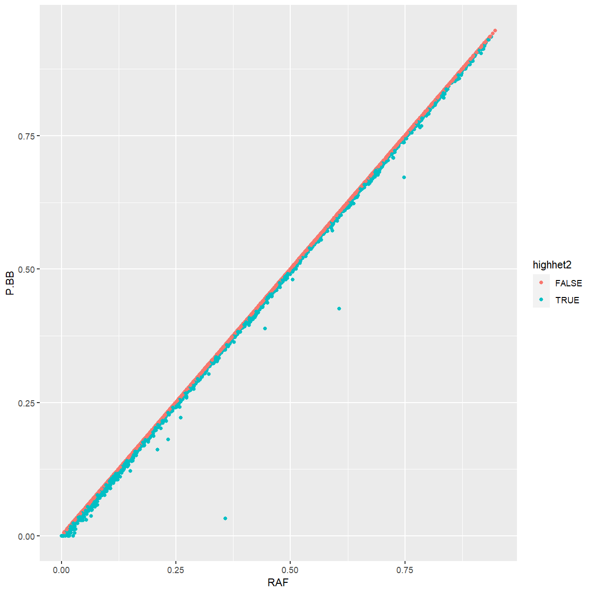
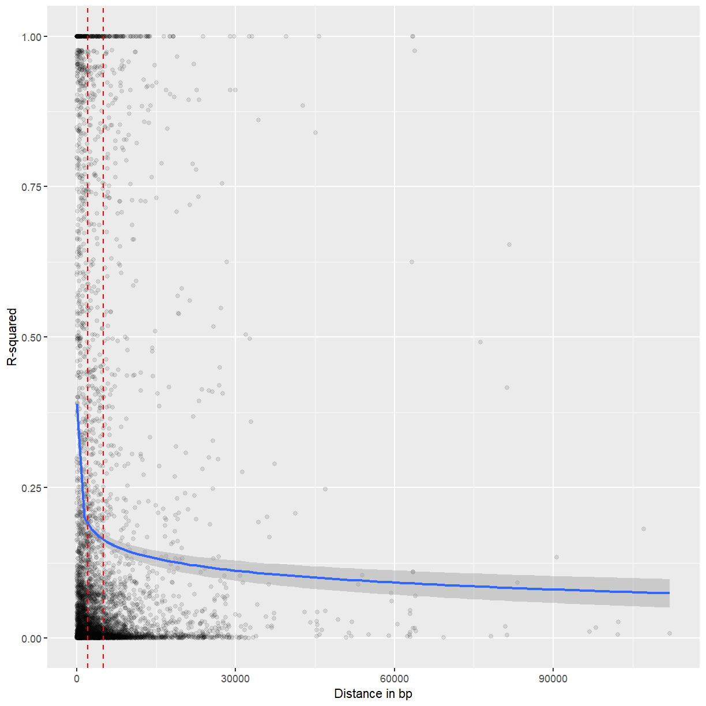

---
# Please do not edit this file directly; it is auto generated.
# Instead, please edit 04-snp-stats.md in _episodes_rmd/
source: Rmd
title: "Running statistics on SNP markers"
teaching: 30
exercises: 10
questions:
- "How can I analyze a SNP dataset in R?"
objectives:
- "Calculate allele frequency, missing data rate, heterozygosity, and linkage disequilibrium."
- "Evaluate population structure using principal coordinates analysis"
keypoints:
- "The snpStats package can convert genotypes to numeric format and calculate statistics."
---

~~~
library(VariantAnnotation)
library(snpStats)
library(ggplot2)
library(scater)
library(magrittr)
~~~
{: .language-r}

Picking up where we left off in the last episode:

~~~
myvcf3 <- VcfFile("data/hmp321_agpv4_chr1_subset_filtered.vcf.bgz")
hdr <- scanVcfHeader(myvcf3)
all_sam <- samples(hdr)
keep_sam <- all_sam[!all_sam %in% c("32", "98F1")]
keep_regions <- GRanges(seqnames = "1",
                        ranges = IRanges(start = c(21.4e6, 22.9e6),
                                         end = c(22.3e6, 23.8e6)))
names(keep_regions) <- c("Region_1", "Region_2")
svp <- ScanVcfParam(info = c("DP", "MAF"), geno = "GT",
                    samples = keep_sam, which = keep_regions,
                    fixed = "ALT")
mydata <- readVcf(myvcf3, param = svp, genome = seqlevels(keep_regions))
~~~
{: .language-r}

## Converting from VCF to snpMatrix

The `snpStats` package has a number of functions for analyzing SNP data.  It
uses its own class called `SnpMatrix`. Luckily there is a conversion function
for `CollapsedVCF` objects, which is what we have.

~~~
mysnpmat <- genotypeToSnpMatrix(mydata)
~~~
{: .language-r}

~~~
Warning in .local(x, ...): variants with >1 ALT allele are set to NA
~~~
{: .warning}

~~~
non-single nucleotide variations are set to NA
~~~
{: .output}

~~~
mysnpmat
~~~
{: .language-r}

~~~
$genotypes
A SnpMatrix with  198 rows and  24528 columns
Row names:  2005-4 ... german_EZ5 
Col names:  1-21094080 ... 1-23395848 

$map
DataFrame with 24528 rows and 4 columns
        snp.names       allele.1           allele.2    ignore
      <character> <DNAStringSet> <DNAStringSetList> <logical>
1      1-21094080              A                  G     FALSE
2      1-21094095              C                  G     FALSE
3      1-21094140              A                  G     FALSE
4      1-21094172              G                  T     FALSE
5      1-21094216              C                  T     FALSE
...           ...            ...                ...       ...
24524  1-23395014              C                  T     FALSE
24525  1-23395152              C                  T     FALSE
24526  1-23395224              A                  G     FALSE
24527  1-23395794              G                  A     FALSE
24528  1-23395848              C                  T     FALSE
~~~
{: .output}

The `ignore` column indicates markers that were ignored for having multiple
alleles, being insertions or deletions, or being coded in a non-diploid
fashion.  Let's also see how the genotypes are stored.

~~~
matrix(as.numeric(mysnpmat$genotypes[1:10,1:10]),
       nrow = 10, ncol = 10)
~~~
{: .language-r}

~~~
      [,1] [,2] [,3] [,4] [,5] [,6] [,7] [,8] [,9] [,10]
 [1,]    1    1    1    1    1    1    3    3    3     0
 [2,]    1    1    1    1    1    1    3    1    3     0
 [3,]    1    1    1    1    1    1    1    1    1     0
 [4,]    1    1    1    3    1    1    3    1    1     0
 [5,]    1    1    1    1    1    1    1    1    1     0
 [6,]    1    1    1    1    1    1    3    1    1     0
 [7,]    1    1    1    1    1    1    1    1    1     0
 [8,]    1    1    1    1    1    1    1    1    1     0
 [9,]    1    1    1    3    1    1    3    1    1     0
[10,]    1    1    1    1    1    1    3    1    1     0
~~~
{: .output}

In this case, 1 and 3 indicate homozygotes, 2 indicates a heterozygote, and 0
indicates missing data.

> ## Reading from other formats
>
> If you want to import to the snpStats package from other formats such as PED
> or PLINK, see the following vignette:
>
> 
> ~~~
> vignette("data-input-vignette", package = "snpStats")
> ~~~
> {: .language-r}
>
> You can also use `write.plink` to export to PLINK format.
{: .callout}

## Basic statistics and filtering on SNPs

There's not a lot of point to keeping SNPs that were all set to 0, so let's
eliminate them using the `ignore` column.

~~~
mat <- mysnpmat$genotypes[,!mysnpmat$map$ignore]
mat
~~~
{: .language-r}

~~~
A SnpMatrix with  198 rows and  21136 columns
Row names:  2005-4 ... german_EZ5 
Col names:  1-21094080 ... 1-23395848 
~~~
{: .output}

The `summary` function give us an overview of the dataset. Here, "rows" are
samples and "cols" are SNPs.

~~~
summary(mat)
~~~
{: .language-r}

~~~
$rows
   Call.rate      Certain.calls Heterozygosity     
 Min.   :0.8407   Min.   :1     Min.   :0.0001559  
 1st Qu.:0.9623   1st Qu.:1     1st Qu.:0.0013602  
 Median :0.9751   Median :1     Median :0.0024126  
 Mean   :0.9662   Mean   :1     Mean   :0.0061321  
 3rd Qu.:0.9802   3rd Qu.:1     3rd Qu.:0.0043879  
 Max.   :1.0000   Max.   :1     Max.   :0.1447796  

$cols
     Calls         Call.rate      Certain.calls      RAF         
 Min.   : 42.0   Min.   :0.2121   Min.   :1     Min.   :0.00000  
 1st Qu.:192.0   1st Qu.:0.9697   1st Qu.:1     1st Qu.:0.05303  
 Median :195.0   Median :0.9848   Median :1     Median :0.13590  
 Mean   :191.3   Mean   :0.9662   Mean   :1     Mean   :0.25637  
 3rd Qu.:197.0   3rd Qu.:0.9949   3rd Qu.:1     3rd Qu.:0.42934  
 Max.   :198.0   Max.   :1.0000   Max.   :1     Max.   :0.95408  
                                                                 
      MAF               P.AA              P.AB               P.BB        
 Min.   :0.00000   Min.   :0.04592   Min.   :0.000000   Min.   :0.00000  
 1st Qu.:0.05303   1st Qu.:0.56680   1st Qu.:0.000000   1st Qu.:0.05051  
 Median :0.13077   Median :0.86224   Median :0.005076   Median :0.13265  
 Mean   :0.17412   Mean   :0.74066   Mean   :0.005942   Mean   :0.25340  
 3rd Qu.:0.29124   3rd Qu.:0.94444   3rd Qu.:0.010204   3rd Qu.:0.42487  
 Max.   :0.50000   Max.   :1.00000   Max.   :0.628571   Max.   :0.95408  
                                                                         
     z.HWE        
 Min.   :-14.071  
 1st Qu.:-13.928  
 Median :-13.626  
 Mean   :-13.268  
 3rd Qu.:-13.166  
 Max.   :  4.514  
 NA's   :59       
~~~
{: .output}
 
The "call rate" is the proportion of data that were non-missing.  So, the
samples ranged from 0-16% missing data, and the SNPs ranged from 0-79%
missing data.  100% of calls were certain because we imported from the `GT`
field, but if we had imported from the `GL` field there would have been some
uncertainty.  Each sample has a proportion heterozygosity called, which could
be used to confirm hybrid vs. inbred individuals or identify sample
contamination.  Allele frequencies, per SNP, are expressed both with respect to
the ALT allele (`RAF`) and the minor allele (`MAF`).  We have frequencies of
all three possible genotypes for a diploid.  Lastly we have the z-statistic for
departure from Hardy-Weinberg Equilibrium.

Let's look at per-sample data.

~~~
sample_stats <- row.summary(mat)

ggplot(sample_stats, aes(x = Call.rate, y = Heterozygosity)) +
  geom_point()
~~~
{: .language-r}

We'll discard outliers for heterozygosity.  In your own work, you might
consider filtering by call rate as well.

~~~
highhet <- isOutlier(sample_stats$Heterozygosity, type = "higher")

ggplot(sample_stats, aes(x = Call.rate, y = Heterozygosity,
                         color = highhet)) +
  geom_point()
~~~
{: .language-r}

~~~
mat2 <- mat[!highhet,]
mat2
~~~
{: .language-r}

~~~
A SnpMatrix with  172 rows and  21136 columns
Row names:  2005-4 ... german_EZ5 
Col names:  1-21094080 ... 1-23395848 
~~~
{: .output}

Now we'll look at stats for the markers.

~~~
marker_stats <- col.summary(mat2)

ggplot(marker_stats, aes(x = MAF)) +
  geom_histogram()
~~~
{: .language-r}

~~~
`stat_bin()` using `bins = 30`. Pick better value with `binwidth`.
~~~
{: .output}

The minor allele frequency has a somewhat strange distribution, but that may
have to do with the structure of the various breeding populations used in this
dataset.

Let's look at ratio of observed to expected heterozygosity.

~~~
marker_stats <- dplyr::mutate(marker_stats, Ho.He = P.AB / (2 * MAF * (1 - MAF)))

ggplot(marker_stats, aes(x = Ho.He)) +
  geom_histogram()
~~~
{: .language-r}

~~~
`stat_bin()` using `bins = 30`. Pick better value with `binwidth`.
~~~
{: .output}

~~~
Warning: Removed 98 rows containing non-finite values (stat_bin).
~~~
{: .warning}

We have a few markers that are much more heterozygous than the rest.  Some come out as
`NA` because the minor allele frequency is zero, and we may as well discard those too.

~~~
highhet2 <- isOutlier(marker_stats$Ho.He, type = "higher")
~~~
{: .language-r}

~~~
Warning in .get_med_and_mad(metric, batch = batch, subset = subset,
share.medians = share.medians, : missing values ignored during outlier detection
~~~
{: .warning}

~~~
highhet2[is.na(highhet2)] <- TRUE

mat3 <- mat2[, !highhet2]
mat3
~~~
{: .language-r}

~~~
A SnpMatrix with  172 rows and  15104 columns
Row names:  2005-4 ... german_EZ5 
Col names:  1-21094080 ... 1-23395224 
~~~
{: .output}

> ## Challenge: P.BB vs. RAF
>
> Using our `marker_stats` data frame and `ggplot`, make a graph of `P.BB` vs.
> `RAF`.  What is your interpretation of this plot?  For an extra challenge,
> color the points by `Ho.He` or by `highhet2`.
>
> > ## Solution
> >
> > 
> > ~~~
> > ggplot(marker_stats, aes(x = RAF, y = P.BB)) + geom_point()
> > ~~~
> > {: .language-r}
> > 
> > 
> > 
> > ~~~
> > ggplot(marker_stats, aes(x = RAF, y = P.BB, color = Ho.He)) + geom_point()
> > ~~~
> > {: .language-r}
> > 
> > 
> > 
> > ~~~
> > ggplot(marker_stats, aes(x = RAF, y = P.BB, color = highhet2)) + geom_point()
> > ~~~
> > {: .language-r}
> > 
> > 
> >
> > Because maize is highly inbred, the frequency of the ALT allele is almost
> > identical the the frequency of homozygotes for the ALT allele.  Markers that
> > differ from that pattern tend to be ones that we identified as being too heterozygous.
> {: .solution}
{: .challenge}

## Linkage Disequilibrium

If we know how much linkage disequilibrium is in our dataset, we know how far
away from a significant SNP to search for candidate genes.  Although not shown
here, it can also be helpful if you want to prune redundant markers.  We'll
calculate it with the `ld` function and visualize the first 500 markers.

~~~
mydepth <- 100 # how many adjacent markers to look at
myLD <- ld(mat3, depth = mydepth, stats = "R.squared", symmetric = FALSE)
~~~
{: .language-r}

~~~
image(myLD[1:500, 1:500], lwd = 0)
~~~
{: .language-r}

There are some loose blocks of LD, but also a lot of adjacent markers that are
not in LD with each other.

We'll get the physical distance between markers based on an approach demonstrated
in `vignette("ld-vignette", package = "snpStats")`.

~~~
pos <- start(rowRanges(mydata)[colnames(mat3)])
nSNP <- length(pos)
diags <- vector("list", mydepth)
for (i in 1:mydepth) diags[[i]] <- pos[(i+1):nSNP] - pos[1:(nSNP-i)]
physical_distance <- bandSparse(nSNP, k=1:mydepth, diagonals=diags)
~~~
{: .language-r}

Now we'll plot LD vs. physical distance.

~~~
physical_distance_vals <- physical_distance@x
LD_vals <- myLD@x

random_subset <- sample(which(physical_distance_vals < 2e5), 5000)

ggplot(mapping = aes(x = physical_distance_vals[random_subset],
                     y = LD_vals[random_subset])) +
  labs(x = "Distance in bp", y = "R-squared") +
  geom_point(alpha = 0.1) +
  geom_smooth(formula = y ~ log(x)) +
  geom_vline(xintercept = c(2000, 5000), color = "red", lty = 2)
~~~
{: .language-r}

~~~
`geom_smooth()` using method = 'gam'
~~~
{: .output}

~~~
Warning: Removed 29 rows containing non-finite values (stat_smooth).
~~~
{: .warning}

~~~
Warning: Removed 29 rows containing missing values (geom_point).
~~~
{: .warning}

Most but not all LD seems to decay after 2-5 kb.

## Principal components analysis

We should visualize the population structure of the dataset.  This can help
identify groupings that should be accounted for in GWAS or other analysis.  It
can also help to identify groups of samples that are very different from the
rest due to species misidentification or technical issues.

First, we'll use the `xxt` function to fill in missing data and multiply the
genotype matrix by itself transposed.

~~~
my_xxt <- xxt(mat3)
~~~
{: .language-r}

Then, we'll use `eigen` to perform PCA.

~~~
my_pca <- eigen(my_xxt, symmetric = TRUE)
~~~
{: .language-r}

We'll visualize the percentage variation explained by each axis.

~~~
percent_variation <- round(my_pca$values/sum(my_pca$values) * 100, 2)
plot(percent_variation)
~~~
{: .language-r}

The cutoff is arbitrary, but probably at least the first six PCs are worth
investigating.  We'll make a function to plot PCs by number.

~~~
plotPCs <- function(x, y, eigenvect = my_pca$vectors,
                    pct_var = percent_variation){
  ggplot(mapping = aes(x = eigenvect[,x], y = eigenvect[,y])) +
    geom_point() +
    labs(x = paste0("PC", x, " (", pct_var[x], "%)"),
         y = paste0("PC", y, " (", pct_var[y], "%)"))
}

plotPCs(1, 2)
~~~
{: .language-r}

~~~
plotPCs(3, 4)
~~~
{: .language-r}

~~~
plotPCs(5, 6)
~~~
{: .language-r}

Nothing here is too concerning.  We might want to export the PCA
values and see what individuals get separated out on which axes.

~~~
pca_tab <- data.frame(Sample = rownames(mat3),
                      my_pca$vectors[,1:6])
colnames(pca_tab)[-1] <- paste0("PC", 1:6)

pca_tab %>% dplyr::filter(PC1 < -0.05) %>%
  dplyr::select(Sample, PC1, PC2)
~~~
{: .language-r}

~~~
               Sample         PC1         PC2
1              2005-4 -0.13525727  0.09480374
2                 207 -0.19065895  0.07388037
3               78004 -0.06547668 -0.11441417
4              83IBI3 -0.18867283  0.07281932
5                9058 -0.16032711  0.11623400
6               CT109 -0.15518523  0.11236514
7                 D20 -0.16232946  0.12437606
8                D857 -0.16351580  0.12604026
9                E588 -0.15697666  0.12490506
10               FR14 -0.06776477 -0.11502232
11               H114 -0.12896322  0.04600527
12              HD568 -0.19024578  0.07434204
13        huangchanga -0.14306171  0.11791188
14                LH1 -0.19111678  0.07353775
15                LP1 -0.06212702 -0.10273509
16               N192 -0.06209931  0.13797158
17                N42 -0.10046524  0.15733457
18              NS501 -0.06623449 -0.11428079
19               Pa91 -0.06373167 -0.10726813
20              PHG50 -0.18753704  0.07263444
21              PHG83 -0.19041778  0.07249585
22              PHJ31 -0.10922145 -0.02493382
23              PHM10 -0.19191092  0.07482949
24              PHN11 -0.18990018  0.07401101
25              R1656 -0.16294629  0.12403325
26 ZEAxppRBMDIAAPEI-6 -0.06883696 -0.11787323
27        282set_A634 -0.06693384 -0.11678946
28        282set_A654 -0.05176967  0.01533634
29        282set_B103 -0.14677217  0.04077557
30        282set_CI64 -0.17143190  0.07489318
31        282set_OH7B -0.14651879  0.09233454
32       282set_Pa875 -0.06159597  0.02382521
33         282set_Wf9 -0.06138572  0.02309199
34   german_FF0721H-7 -0.09706747  0.06381097
~~~
{: .output}

~~~
write.csv(pca_tab, file = "maize_pca.csv", row.names = FALSE)
~~~
{: .language-r}

> ## Challenge: Find those accessions
>
> PCs 3 and 4 separate out a tight cluster of individuals, in the upper left
> of the plot.  What are the identities of these?
>
> > ## Solution
> > 
> > ~~~
> > pca_tab %>% dplyr::filter(PC3 < -0.17) %>%
> >   dplyr::select(Sample, PC1, PC2, PC3, PC4)
> > ~~~
> > {: .language-r}
> > 
> > 
> > 
> > ~~~
> >               Sample        PC1         PC2        PC3       PC4
> > 1            CAUMo17 0.06846645 -0.05034345 -0.2097394 0.1410231
> > 2              LH128 0.06781703 -0.05170517 -0.2029908 0.1412591
> > 3               LH51 0.06746680 -0.04877299 -0.2071386 0.1387211
> > 4               LH60 0.06793352 -0.05081062 -0.2060974 0.1407863
> > 5               SG17 0.06832035 -0.05228311 -0.2027568 0.1415698
> > 6 ZEAxppRCODIAAPEI-9 0.06872508 -0.05148261 -0.2081216 0.1423601
> > 7     282set_CI187-2 0.06828446 -0.05171065 -0.2046271 0.1430273
> > ~~~
> > {: .output}
> {: .solution}
{: .challenge}


